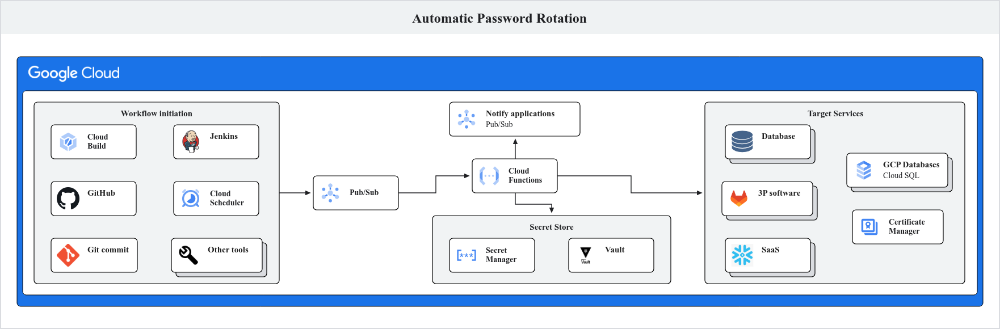
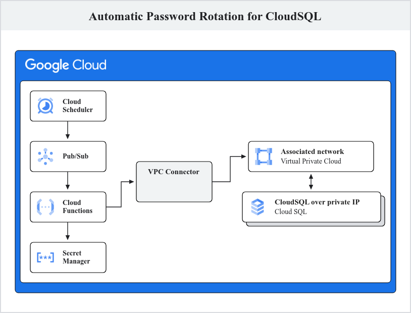

# Overview

Secrets rotation is a broadly accepted best practice across the information
technology industry. However, often times it is cumbersome and disruptive
process. In this guide you will use Google Cloud tools to automate the process
of rotating passwords for a Cloud SQL instance. This method could easily be
extended to other tools and types of secrets.

## Storing passwords in Google Cloud

In Google Cloud, secrets including passwords can be stored using many different
tools including common open source tools such as [Vault][vault], however in this
guide, you will use [Secret Manager][secret-manager], Google Cloud's fully
managed product for securely storing secrets. Regardless of the tool you use,
passwords stored should be further secured. When using [Secret
Manager][secret-manager], following are some of the ways you can further secure
your secrets:

1.  **Limiting access** : The secrets should be readable writable only through
    the [Service Accounts][service-account] via [IAM roles][iam]. The principle
    of least privilege must be followed while granting roles to the service
    accounts.

2.  **Encryption** : The secrets should be encrypted. [Secret
    Manager][secret-manager] encrypts the secret at rest using AES-256 by
    default. But you can use your own encryption keys, customer-managed
    encryption keys (CMEK) to encrypt your secret at rest. For details, see
    [Enable customer-managed encryption keys for Secret
    Manager][enabling-customer-managed-encryption-keys-for-secret-manager].

3.  **Password rotation** : The passwords stored in the secret manager should be
    rotated on a regular basis to reduce the risk of a security incident.

## Why password rotation

Security best practices require us to regularly rotate the passwords in our
stack. Changing the password mitigates the risk in the event where passwords are
compromised.

## How to rotate passwords

Manually rotating the passwords is an antipattern and should not be done as it
exposes the password to the human rotating it and may result in security and
system incidents. Manual rotation processes also introduce the risk that the
rotation isn't actually performed due to human error, for example forgetting or
typos.

This necessitates having a workflow that automates password rotation. The
password could be of an application, a database, a third-party service or a SaaS
vendor etc.

## Automatic password rotation

Typically, rotating a password requires these steps:

- Change the password in the underlying software or system

(such as applications,databases, SaaS).

- Update Secret Manager to store the new password.

- Restart the applications that use that password. This will make the

application source the latest passwords.

### Review Secret Manager

1.  In the Cloud Console, using the naviagion menu select
    `Security > Secret Manager`. Confirm that `cloudsql-pswd` is present in the
    list.
2.  Click on `cloudsql-pswd`.
3.  Click three dots icon and select `View secret value` to view the password
    for Cloud SQL database.
4.  Copy the secret value, you will use this in the next section to confirm
    access to the Cloud SQL instance.

The following architecture represents a general design for a systems that can
rotate password for any underlying software/system.



### Workflow

- A pipeline or a [cloud scheduler job][cloud-scheduler] sends a message to a
  pub/sub topic. The message contains the information about the password that is
  to be rotated. For example, this information may include secret ID in secret
  manager, database instance and username if it is a database password.
- The message arriving to the pub/sub topic triggers a [Cloud Run
  Function][cloud-function] that reads the message and gathers information as
  supplied in the message.
- The function changes the password in the corresponding system. For example, if
  the message contained a database instance, database name and user,the function
  changes the password for that user in the given database.
- The function updates the password in secret manager to reflect the = new
  password. It knows what secret ID to update since it was provided in the
  pub/sub message.
- The function publishes a message to a different pub/sub topic indicating that
  the password has been rotated. This topic can be subscribed any application or
  system that may want to know in the event of password rotation, whether to
  re-start themselves or perform any other task.

## Example deployment for automatic password rotation in CloudSQL

The following architecture demonstrates a way to automatically rotate CloudSQL
password.



### Workflow of the example deployment

- A [Cloud Scheduler][cloud-scheduler] job is scheduled to run every 1st day on
  the month. The jobs publishes a message to a Pub/Sub topic containing secret
  ID, Cloud SQL instance name, database, region and database user in the
  payload.
- The message arrival on the pub/sub topic triggers a [Cloud Run
  Function][cloud-function], which uses the information provided in the message
  to connect to the CloudSQL instance via [Serverless VPC
  Connector][vpc-connector] and changes the password. The function uses a
  [service account][service-account] that has [IAM roles][iam] required to
  connect to the Cloud Sql instance.
- The function then updates the secret in Secret Manager.

**Note** : The architecture doesn't show the flow to restart the application
after the password rotation as shown in thee [Generic architecture](#workflow)
but it can be added easily with minimal changes to the Terraform code.

### Deploy the architecture

The code to build the architecture has been provided with this repository.
Follow these instructions to create the architecture and use it:

1.  Open [Cloud Shell][cloud-shell] on Google Cloud Console and log in with your
    credentials.

2.  If you want to use an existing project, get `role/project.owner` role on the
    project and set the environment in Cloud Shell as shown below. Then, move to
    step 4.

    ```shell
     #set shell environment variable
     export PROJECT_ID=<PROJECT_ID>
    ```

    Replace `<PROJECT_ID>` with the ID of the existing project.

3.  If you want to create a new GCP project run the following commands in Cloud
    Shell.

    ```shell
     #set shell environment variable
     export PROJECT_ID=<PROJECT_ID>
     #create project
     gcloud projects create ${PROJECT_ID} --folder=<FOLDER_ID>
     #associate the project with billing account
     gcloud billing projects link ${PROJECT_ID} --billing-account=<BILLING_ACCOUNT_ID>
    ```

    Replace `<PROJECT_ID>` with the ID of the new project. Replace
    `<BILLING_ACCOUNT_ID>` with the billing account ID that the project should
    be associated with.

4.  Set the project ID in Cloud Shell and enable APIs in the project:

    ```shell
     gcloud config set project ${PROJECT_ID}
     gcloud services enable \
      cloudresourcemanager.googleapis.com \
      serviceusage.googleapis.com \
      --project ${PROJECT_ID}
    ```

5.  Download the Git repository containing the code to build the example
    architecture:

    ```shell
     cd ~
     git clone https://github.com/GoogleCloudPlatform/platform-engineering
     cd platform-engineering/reference-architectures/automated-password-rotation/terraform

     terraform init
     terraform plan -var "project_id=$PROJECT_ID"
     terraform apply -var "project_id=$PROJECT_ID" --auto-approve
    ```

    **Note:** It takes around 30 mins for the entire architecture to get
    deployed.

## Review the deployed architecture

Once the Terraform apply has successfully finished, the example architecture
will be deployed in the your Google Cloud project. Before exercising the
rotation process, review and verify the deployment in the Google Cloud Console.

### Review Cloud SQL database

1.  In the Cloud Console, using the naviagion menu select `Databases > SQL`.
    Confirm that `cloudsql-for-pg` is present in the instance list.
2.  Click on `cloudsql-for-pg`, to open the instance details page.
3.  In the left hand menu select `Users`. Confirm you see a user with the name
    `user1`.
4.  In the left hand menu select `Databases`. Confirm you see see a database
    named `test`.
5.  In the left hand menu select `Overview`.
6.  In the `Connect to this instance` section, note that only
    `Private IP address` is present and no public IP address. This restricts
    access to the instance over public network.

### Review Cloud Scheduler job

1.  In the Cloud Console, using the naviagion menu select
    `Integration Services > Cloud Scheduler`. Confirm that
    `password-rotator-job` is present in the Scheduler Jobs list.
2.  Click on `password-rotator-job`, confirm it is configured to run on 1st of
    every month.
3.  Click `Continue` to see execution configuration. Confirm the following
    settings:

    - `Target type` is Pub/Sub
    - `Select a Cloud Pub/Sub topic` is set to `pswd-rotation-topic`
    - `Message body` contains a JSON object with the details of the Cloud SQL
      isntance and secret to be rotated.

4.  Click `Cancel`, to exit the Cloud Scheduler job details.

### Review Pub/Sub topic configuration

1.  In the Cloud Console, using the naviagion menu select `Analytics > Pub/Sub`.
2.  In the left hand menu select `Topic`. Confirm that `pswd-rotation-topic` is
    present in the topics list.
3.  Click on `pswd-rotation-topic`.
4.  In the `Subscriptions` tab, click on Subscription ID for the rotator Cloud
    Function.
5.  Click on the `Details` tab. Confirm, the `Audience` tag shows the rotator
    Cloud Function.
6.  In the left hand menu select `Topic`.
7.  Click on `pswd-rotation-topic`.
8.  Click on the `Details` tab.
9.  Click on the schema in the `Schema name` field.
10. In the `Details`, confirm that the schema contains these keys: `secretid`,
    `instance_name`, `db_user`, `db_name` and `db_location`. These keys will be
    used to identify what database and user password is to be rotated.

### Review Cloud Run Function

1.  In the Cloud Console, using the naviagion menu select
    `Serverless > Cloud Run Functions`. Confirm that `pswd_rotator_function` is
    present in the list.
2.  Click on `pswd_rotator_function`.
3.  Click on the `Trigger` tab. Confirm that the field `Receive events from` has
    the Pub/Sub topic `pswd-rotation-topic`. This indicates that the function
    will run when a message arrives to that topic.
4.  Click on the `Details` tab. Confirm that under `Network Settings` VPC
    connector is set to `connector-for-sql`. This allows the function to connect
    to the CloudSQL over private IPs.
5.  Click on the `Source` tab to see the python code that the function executes.

**Note:** For the purpose of this tutorial, the secret is accessible to the
human users and not encrypted. See
[the section](#storing-passwords-in-google-cloud) and [Secret Manager best
practice][secret-manager-best-practice]

### Verify that you are able to connect to the Cloud SQL instance

1.  In the Cloud Console, using the naviagion menu select `Databases > SQL`
2.  Click on `cloudsql-for-pg`
3.  In the left hand menu select `Cloud SQL Studio`.
4.  In `Database` dropdown, choose `test`.
5.  In `User` dropdown, choose `user1`.
6.  In `Password` textbox paste the password copied from the `cloudsql-pswd`
    secret.
7.  Click `Authenticate`. Confirm you were able to log in to the database.

## Rotate the Cloud SQL password

Typically, the Cloud Scheduler will automatically run on 1st day of every month
triggering password rotation. However, for this tutorial you will run the Cloud
Scheuler job manually, which causes the Cloud Run Function to generate a new
password, update it in Cloud SQL and store it in Secret Manager.

1.  In the Cloud Console, using the naviagion menu select
    `Integration Services > Cloud Scheduler`.
2.  For the scheduler job `password-rotator-job`. Click the three dots icon and
    select `Force run`.
3.  Verify that the `Status of last execution` shows `Success`.
4.  In the Cloud Console, using the naviagion menu select
    `Serverless > Cloud Run Functions`.
5.  Click function named `pswd_rotator_function`.
6.  Select the `Logs` tab.
7.  Review the logs and verify the function has run and completed without
    errors. Successful completion will be noted with log entries containing
    `DB password changed successfully` , `DB password verified successfully` and
    `Secret cloudsql-pswd rotated successfully!`.

## Test the new password

1.  In the Cloud Console, using the naviagion menu select
    `Security > Secret Manager`. Confirm that `cloudsql-pswd` is present in the
    list.
2.  Click on `cloudsql-pswd`. Note you should now see a new version, version 2
    of the secret.
3.  Click three dots icon and select `View secret value` to view the password
    for Cloud SQL database.
4.  Copy the secret value.
5.  In the Cloud Console, using the naviagion menu select `Databases > SQL`
6.  Click on `cloudsql-for-pg`
7.  In the left hand menu select `Cloud SQL Studio`.
8.  In `Database` dropdown, choose `test`.
9.  In `User` dropdown, choose `user1`.
10. In `Password` textbox paste the password copied from the `cloudsql-pswd`
    secret.
11. Click `Authenticate`. Confirm you were able to log in to the database.

## Conclusion

In this tutorial, you saw a way to automate password rotation on Google Cloud.
First, you saw a generic reference architecture that can be used to automate
password rotation in any password management system. In the later section, you
saw an example deployment that uses Google Cloud services to rotate password of
Cloud Sql database in Google Cloud Secret Manager.

Implementing an automatic flow to rotate passwords takes away manual overhead
and provide seamless way to tighten your password security. It is recommended to
create an automation flow that runs on a regular schedule but can also be easily
triggered manually when needed. There can be many variations of this
architecture that can be adopted. For example, you can directly trigger a Cloud
Run Function from a Google Cloud Scheduler job without sending a message to
pub/sub if you don't want to broadcast the password rotation. You should
identify a flow that fits your organization requirements and modify the
reference architecture to implement it.

[secret-manager]: https://cloud.google.com/security/products/secret-manager
[iam]: https://cloud.google.com/security/products/iam
[service-account]: https://cloud.google.com/iam/docs/service-account-overview
[enabling-customer-managed-encryption-keys-for-secret-manager]:
    https://cloud.google.com/secret-manager/docs/cmek
[cloud-scheduler]: https://cloud.google.com/scheduler
[cloud-function]: https://cloud.google.com/functions?hl=en
[vpc-connector]: https://cloud.google.com/vpc/docs/serverless-vpc-access
[cloud-shell]: https://console.cloud.google.com/welcome?cloudshell=true
[secret-manager-best-practice]:
    https://cloud.google.com/secret-manager/docs/best-practices
[vault]: https://www.vaultproject.io/
