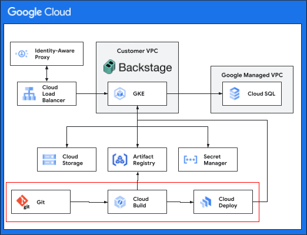

# CI/CD for Backstage on Google Cloud

This deployment guide can be used to set up a CI/CD pipeline for [Backstage][backstage] running on Google Cloud. This guide builds on the [quickstart][quickstart] and assumes the GKE cluster, Cloud SQL database are all setup and running. The goal of this guide is to demonstrate how to go beyond a single deployment but long-lived deployment that you can build on as a part of your internal developer platform. If you have not already done so we encourage you to review and run through the [quickstart][quickstart] if you have not already done so.

## Architecture

The following diagram depicts the high level architecture of the infrastucture
that will be deployed. The tools in the architecture used to run the Backstage instance are largely the same. In this guide you will be adding tools to improve how your Backstage instance is built and deployed, which are highlighted in red.

## Requirements and Assumptions

To keep this guide simple it makes a few assumptions. Where the are alternatives
we have linked to some additional documentation.

1.  You have worked through Backstage quick start, meaning you have an existing project with Backstage up and running.

<!-- LINKS: https://www.markdownguide.org/basic-syntax/#reference-style-links -->

[backstage]: https://backstage.io/
[quickstart]: ../backstage-quickstart/README.md