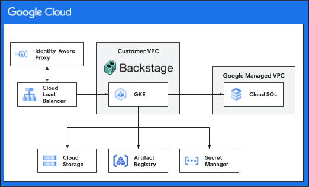

# Backstage on Google Cloud Quickstart

This quick-start deployment guide can be used to set up an environment to
familiarize yourself with the architecture and get an understanding of the
concepts related to hosting [Backstage][backstage] on Google Cloud.

**NOTE: This environment is not intended to be a long lived environment. It is
intended for temporary demonstration and learning purposes. You will need to
modify the configurations provided to align with your orginazations needs.
Along the way the guide will make callouts to tasks or areas that should be
productionized in for long lived deployments.**

## Architecture

The following diagram depicts the high level architecture of the infrastucture
that will be deployed.



## Requirements and Assumptions

To keep this guide simple it makes a few assumptions. Where the are alternatives
we have linked to some additional documentation.

1.  The Backstage quick start will be deployed in a new project that you will 
manually create. If you want to use a project managed through Terraform refer
to the [Terraform managed project](#terraform-managed-project) section.
2.  [Identity Aware Proxy][iap] (IAP) will be used for controlling access to
Backstage.

## Before you begin

In this section you prepare a folder for deployment.

1.  Open the [Cloud Console][cloud-console]
2.  Activate [Cloud Shell][cloud-shell] \
    At the bottom of the Cloud Console, a [Cloud Shell][cloud-shell-features]
    session starts and displays a command-line prompt.

## Project Creation

In this section you prepare your project for deployment.

1.  Go to the [project selector page][project-selector] in the Cloud Console.
    Select or create a Cloud project.

2.  Make sure that billing is enabled for your Google Cloud project.
    [Learn how to confirm billing is enabled for your project][enable-billing].

3.  In Cloud Shell, set environment variables with the ID of your project:

    ```sh
    export PROJECT_ID=<INSERT_YOUR_PROJECT_ID>
    gcloud config set project "${PROJECT_ID}"
    ```

4.  Clone the repository and change directory to the guide directory

    ```bash
    git clone https://github.com/GoogleCloudPlatform/platform-engineering && \
    cd platform-engineering/reference-architectures/backstage/backstage-quickstart
    ```

5.  Set environment variables

    ```bash
    export BACKSTAGE_QS_BASE_DIR=$(pwd) && \
    sed -n -i -e '/^export BACKSTAGE_QS_BASE_DIR=/!p' -i -e '$aexport  \
    BACKSTAGE_QS_BASE_DIR="'"${BACKSTAGE_QS_BASE_DIR}"'"' ${HOME}/.bashrc
    ```

## Project Configuration

1.  Set the project environment variables in Cloud Shell

    ```bash
    export BACKSTAGE_QS_STATE_BUCKET="${PROJECT_ID}-terraform"
    export IAP_USER_DOMAIN="<your org's domain>"
    export IAP_SUPPORT_EMAIL="<your org's support email>"
    ```

2.  Set the default `gcloud` project

    ```bash
    gcloud config set project ${PROJECT_ID}
    ```

3.  Create a Cloud Storage bucket to store the Terraform state

    ```bash
    gcloud storage buckets create gs://${BACKSTAGE_QS_STATE_BUCKET} --project ${PROJECT_ID}
    ```

4.  Set the configuration variables

    ```bash
    sed -i "s/YOUR_STATE_BUCKET/${BACKSTAGE_QS_STATE_BUCKET}/g" ${BACKSTAGE_QS_BASE_DIR}/backend.tf
    sed -i "s/YOUR_PROJECT_ID/${PROJECT_ID}/g" ${BACKSTAGE_QS_BASE_DIR}/backstage-qs.auto.tfvars
    sed -i "s/YOUR_IAP_USER_DOMAIN/${IAP_USER_DOMAIN}/g" ${BACKSTAGE_QS_BASE_DIR}/backstage-qs.auto.tfvars
    sed -i "s/YOUR_IAP_SUPPORT_EMAIL/${IAP_SUPPORT_EMAIL}/g" ${BACKSTAGE_QS_BASE_DIR}/backstage-qs.auto.tfvars
    ```

## Deploy Backstage

Before running Terraform, make sure that the Service Usage API and Service
Management API are enabled.

1.  Enable Service Usage API and Service Management API

    ```bash
    gcloud services enable serviceusage.googleapis.com \
    gcloud services enable servicemanagement.googleapis.com
    ```

2.  Create the resources

    ```bash
    cd ${BACKSTAGE_QS_BASE_DIR} && \
    terraform init && \
    terraform plan -input=false -out=tfplan && \
    terraform apply -input=false tfplan && \
    rm tfplan
    ```

    This will take a while to create all of the required resources, figure somewhere
    between 15 and 20 minutes.

## Cleanup

1.  Destroy the resources using Terraform destroy

    ```bash
    cd ${BACKSTAGE_QS_BASE_DIR} && \
    terraform init && \
    terraform destroy -auto-approve && \
    rm -rf .terraform .terraform.lock.hcl
    ```

2.  Delete the project

    ```bash
    gcloud projects delete ${PROJECT_ID}
    ```

3.  Remove Terraform files and temporary files

    ```bash
    cd ${BACKSTAGE_QS_BASE_DIR} && \
    rm -rf \
    .terraform \
    .terraform.lock.hcl \
    initialize/.terraform \
    initialize/.terraform.lock.hcl \
    initialize/backend.tf.local \
    initialize/state
    ```

4.  Reset the TF variables file

    ```bash
    cd ${BACKSTAGE_QS_BASE_DIR} && \
    cp backstage-qs-auto.tfvars.local backstage-qs.auto.tfvars
    ```

5.  Remove the environment variables

    ```bash
    sed \
    -i -e '/^export BACKSTAGE_QS_BASE_DIR=/d' \
    ${HOME}/.bashrc
    ```

## Advanced Options

### Terraform managed project

In some instances you will need to create and manage the project through
Terraform. This quickstart provides a sample process and Terraform to
create and destory the project via Terraform.

To run this part of the quick start you will need the following information
and permissions.

- Billing account ID
- Organization or folder ID
- `roles/billing.user` IAM permissions on the billing account specified
- `roles/resourcemanager.projectCreator` IAM permissions on the organization or
  folder specified

#### Creating a Terraform managed project

1.  Set the configuration variables

    ```bash
    nano ${BACKSTAGE_QS_BASE_DIR}/initialize/initialize.auto.tfvars
    ```

    ```bash
    environment_name  = "qs"
    iapUserDomain = ""
    iapSupportEmail = ""
    project = {
      billing_account_id = "XXXXXX-XXXXXX-XXXXXX"
      folder_id          = "############"
      name               = "backstage"
      org_id             = "############"
    }
    ```

Values required :

-   `environment_name`: the name of the environment (defaults to qs for
quickstart)
-   `iapUserDomain`: the root domain of the GCP Org that the Backstage users will
be in
-   `iapSupportEmail`: support contact for the IAP brand
-   `project.billing_account_id`: the billing account ID
-   `project.name`: the prefix for the display name of the project, the full name
will be `<project.name>-<environment_name>`
-  Either `project.folder_id` **OR** `project.org_id`
   - `project.folder_id`: the Google Cloud folder ID
   - `project.org_id`: the Google Cloud organization ID

2. Authorize `gcloud`

    ```bash
    gcloud auth login --activate --no-launch-browser --quiet --update-adc
    ```

3.  Create a new project

    ```bash
    cd ${BACKSTAGE_QS_BASE_DIR}/initialize
    terraform init && \
    terraform plan -input=false -out=tfplan && \
    terraform apply -input=false tfplan && \
    rm tfplan && \
    terraform init -force-copy -migrate-state && \
    rm -rf state
    ```

4.  Set the project environment variables in Cloud Shell

    ```bash
    PROJECT_ID=$(grep environment_project_id \
    ${BACKSTAGE_QS_BASE_DIR}/backstage-qs.auto.tfvars | awk -F"=" '{print $2}' | xargs)
    ```
#### Cleaning up a Terraform managed project

1.  Destroy the project

    ```bash
    cd ${BACKSTAGE_QS_BASE_DIR}/initialize && \
    TERRAFORM_BUCKET_NAME=$(grep bucket backend.tf | awk -F"=" '{print $2}' |
    xargs) && \
    cp backend.tf.local backend.tf && \
    terraform init -force-copy -lock=false -migrate-state && \
    gsutil -m rm -rf gs://${TERRAFORM_BUCKET_NAME}/* && \
    terraform init && \
    terraform destroy -auto-approve  && \
    rm -rf .terraform .terraform.lock.hcl state/
    ```

### Re-using an Existing Project

In situations where you have run this quickstart before and then cleaned-up
the resources but are re-using the project, it might be neccasary to restore
the endpoints from a deleted state first.

```bash
BACKSTAGE_QS_PREFIX=$(grep environment_name \
${BACKSTAGE_QS_BASE_DIR}/backstage-qs.auto.tfvars | awk -F"=" '{print $2}' | xargs)
BACKSTAGE_QS_PROJECT_ID=$(grep environment_project_id \
${BACKSTAGE_QS_BASE_DIR}/backstage-qs.auto.tfvars | awk -F"=" '{print $2}' | xargs)
gcloud endpoints services undelete \
${BACKSTAGE_QS_PREFIX}.endpoints.${BACKSTAGE_QS_PROJECT_ID}.cloud.goog \
--quiet 2>/dev/null
```

<!-- LINKS: https://www.markdownguide.org/basic-syntax/#reference-style-links -->

[backstage]: https://backstage.io/
[cloud-console]: https://console.cloud.google.com
[cloud-shell]: https://console.cloud.google.com/?cloudshell=true
[cloud-shell-features]: https://cloud.google.com/shell/docs/features
[enable-billing]: https://cloud.google.com/billing/docs/how-to/modify-project
[iap]: https://cloud.google.com/security/products/iap
[project-selector]: https://console.cloud.google.com/projectselector2/home/dashboard