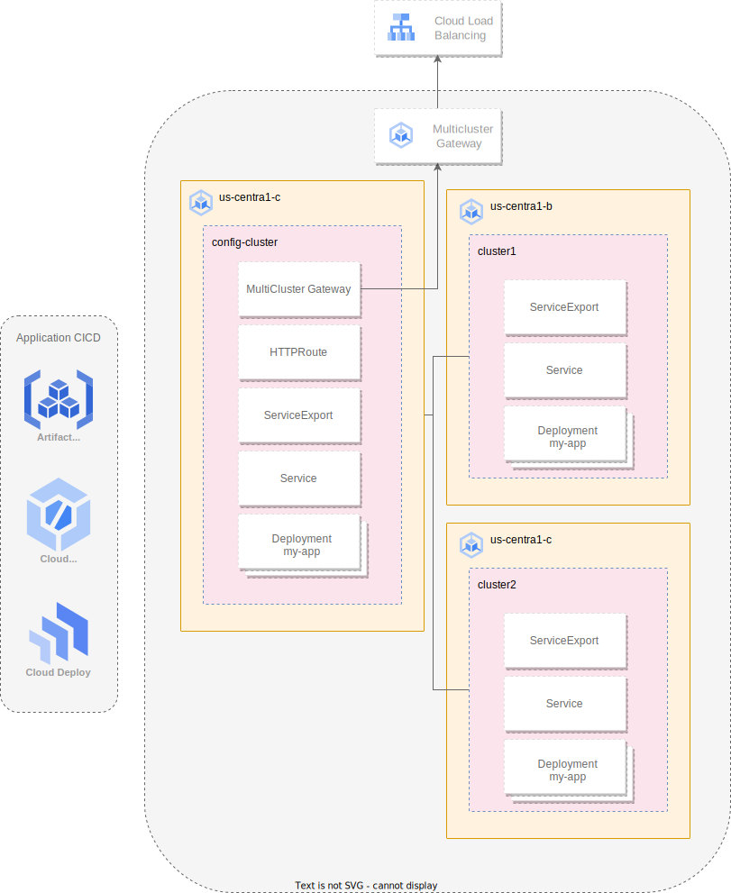

# GKE Multi-Cluster Service Setup and Failover

## Overview

This guide provides a walkthrough of
setting up a basic Google Kubernetes Engine (GKE)
infrastructure and demonstrating the capabilities of
Multi-Cluster Services. We will create two zonal
GKE clusters, deploy a sample application
(`whereami`) to them, and then configure
Multi-Cluster Services to enable seamless
communication between the clusters. The `whereami`
application will be used to illustrate how services
can be accessed across cluster boundaries.
Finally, we'll simulate a failure scenario by
deleting a backend pod to show how
Multi-Cluster Services facilitates automatic
failover, ensuring application availability.

This setup is ideal for understanding the
fundamentals of distributed Kubernetes
deployments on GKE and how Multi-Cluster Services
enhances reliability and resilience.


## Key Concepts Covered

* GKE Cluster Creation: Provisioning zonal GKE
    clusters using Terraform.
* Application Deployment: Deploying a simple
    frontend/backend application to multiple GKE
    clusters.
* Multi-Cluster Services (MCS): Configuring and
    utilizing MCS to enable service discovery and
    access across clusters.
* Failover Demonstration: Simulating a pod failure
    to showcase the automatic failover capabilities
    of MCS.

## Prerequisites

*   A Google Cloud project with billing account linked.
*   Terraform: Install Terraform on your local machine or use Cloud Shell.

## Usage

Set project details and authenticate

```sh
export PROJECT_ID=`YOUR PROJECT_ID`

gcloud config set project $PROJECT_ID
gcloud auth application-default login
```

### Enable Required APIs

Replace `YOUR PROJECT_ID` with your Google Cloud project ID.

```sh
gcloud services enable \
  compute.googleapis.com \
  container.googleapis.com \
  cloudresourcemanager.googleapis.com \
  iam.googleapis.com \
  serviceusage.googleapis.com \
  --project=$PROJECT_ID
```

Navigate to the terraform directory and update the terraform.tfvars

```sh
cd multicluster-patterns/quickstart-multi-zone-deploy
```

## Step 1: Create the Base GKE Infrastructure (Terraform)

You will use Terraform to create two zonal GKE
clusters with fleets enabled in the same region but different zones.

```sh
cd terraform
terraform init
terraform apply -var project_id=$PROJECT_ID
```

## Deploy sample application

We will deploy a simple [whereami](https://github.com/GoogleCloudPlatform/kubernetes-engine-samples/blob/1a90cfeeaed43e2d8bd571f624ba69770300e958/quickstarts/whereami/README.md) application
consisting of a frontend and a backend to both GKE
clusters.

1. Connect to your cluster in `us-central1-a`

```sh
gcloud container clusters get-credentials zonal-cluster-1 --zone us-central1-a --project $PROJECT_ID
```

1. Deploy the frontend and backend

```sh
cd ../
kubectl apply -f manifests/
```

1. Verify the service is up and running

```sh
kubectl run temp-curl-client --rm -it --image=curlimages/curl -- /bin/sh
curl http://whereami-frontend:80
```

This command creates a temporary pod client to access the frontend service from
inside of the the clustr

Output should similar to:

```sh
{
  "backend_result": {
    "cluster_name": "zonal-cluster-1",
    "gce_instance_id": "5796686052760489681",
    "gce_service_account": "807562725141-compute@developer.gserviceaccount.com",
    "host_header": "whereami-backend",
    "metadata": "backend",
    "node_name": "gke-zonal-cluster-1-default-pool-08f46fa6-n01h",
    "pod_ip": "10.68.3.5",
    "pod_name": "whereami-backend-76ff54c56d-k6qk7",
    "pod_name_emoji": "🤽‍♀",
    "pod_namespace": "default",
    "pod_service_account": "whereami-backend",
    "project_id": "test-mcs1",
    "timestamp": "2025-04-02T22:20:36",
    "zone": "us-central1-b"
  },
  "cluster_name": "zonal-cluster-1",
  "gce_instance_id": "3363897077431012570",
  "gce_service_account": "807562725141-compute@developer.gserviceaccount.com",
  "host_header": "34.58.94.74",
  "metadata": "frontend",
  "node_name": "gke-zonal-cluster-1-default-pool-08f46fa6-t894",
  "pod_ip": "10.68.2.4",
  "pod_name": "whereami-frontend-7f984d8f64-djnh4",
  "pod_name_emoji": "🇫🇮",
  "pod_namespace": "default",
  "pod_service_account": "whereami-frontend",
  "project_id": "test-mcs1",
  "timestamp": "2025-04-02T22:20:36",
  "zone": "us-central1-b"
}
```

1. Deploy the application into the second cluster

```sh
gcloud container clusters get-credentials zonal-cluster-2 --zone us-central1-b --project $PROJECT_ID
kubectl apply -f manifests/
```

## Configure multi-cluster management

When deploying multiple clusters in different zones/regions a common challenge
occurs when exposing workloads through a single endpoint. Manually configuring
 this using Network Endpoint Groups (NEGs), custom Ingress resources, and
 load balancer settings is possible, but the process is error-prone, operationally
 complex, and hard to scale.
[Multi-cluster Gateway](https://cloud.google.com/kubernetes-engine/docs/how-to/migrate-gke-multi-cluster)
rovides a fully managed solution for seamless traffic routing across clusters
behind a single external IP, without the need for custom routing logic or manual
 NEG configuration.

# [TODO ADD image to illustrate]

In the following section, you will:

*   Register both clusters to a Fleet
*   Enable Multi-Cluster Services (MCS)
*   Configure Gateway API support on both GKE clusters

1. Enable required services

```sh
gcloud services enable \
  gkehub.googleapis.com \
  trafficdirector.googleapis.com \
  multiclusterservicediscovery.googleapis.com \
  multiclusteringress.googleapis.com \
  --project=$PROJECT_ID
```

> Note As part of the Terraform setup, each cluster was registered as part of a [fleet](https://cloud.google.com/kubernetes-engine/fleet-management/docs)

```sh
resource "google_container_cluster" "cluster_1" {
  name     = "zonal-cluster-1"
...
  fleet {
    project = var.project_id
  }
}
```

1. Confirm the clusters are registered

```sh
gcloud container fleet memberships list --project=$PROJECT_ID
```

1. Enable multi-cluster-Services in the fleet to activate the
[multi-cluster Services (MCS)](https://cloud.google.com/kubernetes-engine/docs/concepts/multi-cluster-services)
controllers on your fleet clusters, which is required to enable cross-cluster
 service discovery and communication between them.

```sh
gcloud container fleet multi-cluster-services enable \
    --project $PROJECT_ID
```

1. Grant Identity and Access Management (IAM) permissions required by the MCS controller:

```sh
gcloud projects add-iam-policy-binding $PROJECT_ID \
    --member "serviceAccount:$PROJECT_ID.svc.id.goog[gke-mcs/gke-mcs-importer]" \
    --role "roles/compute.networkViewer" \
    --project=$PROJECT_ID
```

1. Confirm that MCS is enabled for the registered clusters. You will see the
 memberships for the three registered clusters. It may take several minutes
  for all of the clusters to show.

```sh
gcloud container fleet multi-cluster-services describe --project=$PROJECT_ID
```

Output should be similar to the follow:

```sh
createTime: '2025-04-02T23:48:38.171804547Z'
membershipStates:
  projects/807562725141/locations/us-central1/memberships/autopilot-cluster-1:
    state:
      code: OK
      description: Firewall successfully updated
      updateTime: '2025-04-02T23:52:29.790474720Z'
  projects/807562725141/locations/us-central1/memberships/zonal-cluster-1:
    state:
      code: OK
      description: Firewall successfully updated
      updateTime: '2025-04-02T23:52:35.843646177Z'
  projects/807562725141/locations/us-central1/memberships/zonal-cluster-2:
    state:
      code: OK
      description: Firewall successfully updated
      updateTime: '2025-04-02T23:52:30.629358192Z'
name: projects/test-mcs1/locations/global/features/multiclusterservicediscovery
resourceState:
  state: ACTIVE
spec: {}
updateTime: '2025-04-02T23:48:41.391830411Z'
```

## Multi-cluster Gateway and multi-cluster Service

#[TODO Add image]
In this section, you will:

* Deploy a the multi-cluster ServiceExport for for cross-cluster discovery. This YAML defines a ServiceExport resource using GKE's Multi-cluster Services API (net.gke.io/v1). Its name, whereami-frontend, signals the intent to export the Kubernetes Service with the exact same name located in the same namespace. Creating this resource makes the whereami-frontend Service's Pods discoverable across the GKE fleet. This allows multi-cluster Gateways to find and route traffic to this service, even across different clusters.

```yaml
kind: ServiceExport
apiVersion: net.gke.io/v1
metadata:
  name: whereami-frontend
```

* Configure a [Gateway](https://cloud.google.com/kubernetes-engine/docs/how-to/deploying-multi-cluster-gateways#deploy-gateway) using the gke-l7-global-external-managed-mc GatewayClass. This Gateway creates an external Application Load Balancer configured to distribute traffic across your target clusters.

```yaml
apiVersion: gateway.networking.k8s.io/v1beta1
kind: Gateway
metadata:
  name: external-http
spec:
  gatewayClassName: gke-l7-global-external-managed-mc
  listeners:
  - name: http
    protocol: HTTP
    port: 80
    allowedRoutes:
      kinds:
      - kind: HTTPRoute
```

* Create a HTTPRoute resource. It attaches to the Gateway external-http and sets
up traffic routing rules. Specifically, it matches all incoming requests
 (path prefix /) and forwards them to port 80 of the whereami-frontend Service.

```yaml
apiVersion: gateway.networking.k8s.io/v1beta1
kind: HTTPRoute
metadata:
  name: public-store-route
  labels:
    gateway: external-http
spec:
  parentRefs:
  - name: external-http
  rules:
  - matches: # Match requests based on criteria
    - path:
        type: PathPrefix # Match any path starting with /
        value: /
    backendRefs: # Forward matched traffic to the backend service
    - name: whereami-frontend
      port: 80
```

1. Deploy the only ServiceExport to zonal-cluster-2

```sh
gcloud container clusters get-credentials zonal-cluster-2 --zone us-central1-b --project $PROJECT_ID
kubectl apply -f manifests/mcg/frontend-serviceexport.yaml

```

1. Deploy the ServiceExport, Gateway and the HTTPRoute to cluster1. This cluster
 serve as the controller cluster

```sh
gcloud container clusters get-credentials zonal-cluster-1 --zone us-central1-a --project $PROJECT_ID
kubectl apply -f manifests/mcg
```

> Note: It might take upto 10 minutes for the endpoint to beginning accepting traffic

1. Once the Gateway has deployed successfully retrieve the external IP address from external-http Gateway.

```sh
export VIP=$(kubectl get gateways.gateway.networking.k8s.io external-http -o=jsonpath="{.status.addresses[0].value}")
curl http://$VIP/
```

1. Watch the traffic

```sh
for i in {1..3}; do curl $ENDPOINT -s | jq '{frontend: .zone, backend: .backend_result.zone}' -c; done
````

Output should be similar to the following:

```sh
{"frontend":"us-central1-b","backend":"us-central1-b"}
{"frontend":"us-central1-b","backend":"us-central1-b"}
{"frontend":"us-central1-b","backend":"us-central1-b"}
```
