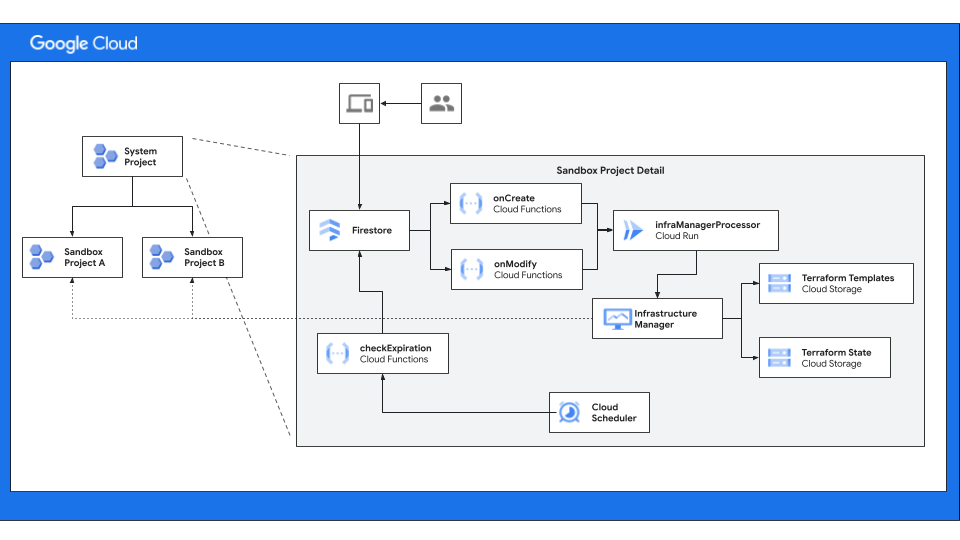

# Sandbox Projects Reference Architecure

This architecture demonstrates a golden path where sandbox projects can be
self-service provisioned with sensbile guardrails and constraints. A sandbox
project is a short lived project where engineers can experiment with new
technologies. Projects provisioned for a short period of time and with budget
constraints.

## Architecture

The following diagram is the high-level architecture for the enabling
self-service creation of sandbox projects.

1.  The system project is contains the state database and infrastructure
    required to create, delete and manage they lifecycle of the sandboxes.
2.  User interface that engineers use to request and manage the sandboxes they
    own.
3.  Firestore is used to store the state of the overall environment. The
    documents in the database represent all the active and inactive sandboxes.
    The document model is detailed in the
    [sandbox-modules readme](sandbox-modules/README.md).
4.  When documents are created and updated, those events are received by Cloud
    Run functions `onCreate` and `onModify`. The functions contain the logic
    required to decided if a sandbox should be created or deleted.
5.  `infraManagerProcessor` is a Cloud Run process with works with
    Infrastructure Manager to kick off and monitor the infrastructure
    management. This is handled in a Cloud Run process because the execution of
    Terraform is along running process.
6.  The Terraform templates and state used by Infrastructure manager are stored
    in Cloud Storage.
7.  Cloud Scheduler is used to trigger the execution of sandbox lifecycle
    management processes, for example a function that check for the expiration
    of sandboxes and marking them for deletion.

## Structure of the Repository

This repository contains the code to stand up the reference architecture and
also create difference sandbox templates in the catalog. This section describes
the structure of the repository so you can better navigate the code.

### Examples

The examples directory contains a sample Terraform deployment for deploying the
refrence architecture and command-line tool to exercise the golden path. The
examples are intended to provide you a starting point so you can incorporate the
reference architecure into your infrastructure.

#### GCP Sandboxes

This [example][example-terraform] uses the Terraform modules from
`/sandbox-modules` to stand up the reference architecture and includes
instructions on how to get started.

#### Command Line Interface (CLI)

As noted in the detailed description of the reference architecture the workflows
and lifecyle of the sandboxes is managed through the document model stored in
[Cloud Firestore][firestore]. This abstraction has the benefit of separating the
core logic included in the reference archiecture from the user experience (UX).
As such the [example command line interface][example-cli], provides a tool you
can use to experiment with the reference architecture and learn about the object
model.

### Catalog

This directory contains a collection (catalog) of templates that can be used to
instaniate sandboxes. The reference architecture includes one for an empty
project, but others could be added to support more specialized roles such as
database admins, AI engineers, etc.

### Sandbox Modules

These modules use the fabric modules to create the system project, which
facilitates the lifecycle of the sandbox projects. Each module represents a
large component of the overall reference architecture and each component can be
combined into the one system project or spread across different projects to help
with separation of duties.

### Fabric Modules

These are the base Terraform modules adopted from the [Cloud Fabric
Foundation][foundation-fabric]. The fabric foundation is intended to be vendor,
so we have copied them here for repeatbility of the overall deployment of the
reference architecture.

We recommend that as you need additional modules for templates in the catalog
that you start with and vendor the modules from the Cloud Foundation Fabric into
this directory.

<!-- LINKS: https://www.markdownguide.org/basic-syntax/#reference-style-links -->

[example-terraform]: examples/gcp-sandboxes/README.md
[example-cli]: examples/cli/README.md
[firestore]: https://cloud.google.com/products/firestore
[foundation-fabric]:
    https://github.com/GoogleCloudPlatform/cloud-foundation-fabric/tree/master/modules#readme
